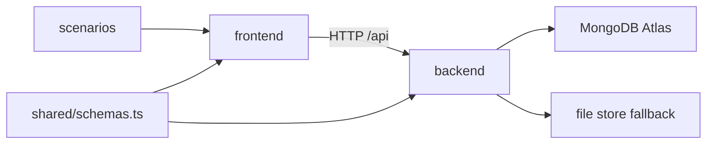

# Project Graph: financial_assistant_project

This file is the quick navigation map for the repository.
It is generated and refreshed with `./scripts/update-project-graph.sh`.

## Graphify Outputs

- Code graph JSON: `graphify-out/graph.json`
- Graph report: `graphify-out/GRAPH_REPORT.md`

## High-Level Module Graph



## Folder Tree (depth <= 3, trimmed)

```text
- .codex
  - hooks.json
- .gitignore
- AGENTS.md
- DEPLOYMENT_VERCEL.md
- backend
  - .env.example
  - .gitignore
  - api
    - index.ts
  - package-lock.json
  - package.json
  - railway.json
  - src
    - alertService.ts
    - app.ts
    - repository.ts
    - server.ts
    - summaryService.ts
    - types.ts
    - validation.ts
  - tests
    - summaryAlert.test.js
    - summaryAlert.test.ts
  - tsconfig.json
  - vercel.json
- docs
  - PROJECT_GRAPH.md
  - architecture.md
  - tradeoffs.md
  - ui-system.md
- frontend
  - .env.example
  - .gitignore
  - README.md
  - eslint.config.js
  - index.html
  - package-lock.json
  - package.json
  - public
    - favicon.svg
    - icons.svg
    - scenarios
  - src
    - App.css
    - App.tsx
    - api
    - assets
    - components
    - index.css
    - main.tsx
    - pages
    - types
  - tsconfig.app.json
  - tsconfig.json
  - tsconfig.node.json
  - vercel.json
  - vite.config.ts
- graphify-out
  - GRAPH_REPORT.md
  - graph.json
- render.yaml
- scenarios
  - README.md
  - food-cap
    - evaluation.md
    - expected-alerts.json
    - expected-summary.json
    - rules.json
    - transactions.csv
  - subscription-creep
    - evaluation.md
    - expected-alerts.json
    - expected-summary.json
    - rules.json
    - transactions.csv
  - transport-budget
    - evaluation.md
    - expected-alerts.json
    - expected-summary.json
    - rules.json
    - transactions.csv
  - uncategorized-risk
    - evaluation.md
    - expected-alerts.json
    - expected-summary.json
    - rules.json
    - transactions.csv
- scripts
  - generate-test-data.js
  - update-project-graph.sh
- shared
  - schemas.ts
```

## Refresh Commands

```bash
# Rebuild Graphify code graph
graphify update .

# Reinstall/repair Codex Graphify hook if needed
graphify codex install

# Refresh both graphify output + this folder graph doc
./scripts/update-project-graph.sh
```
