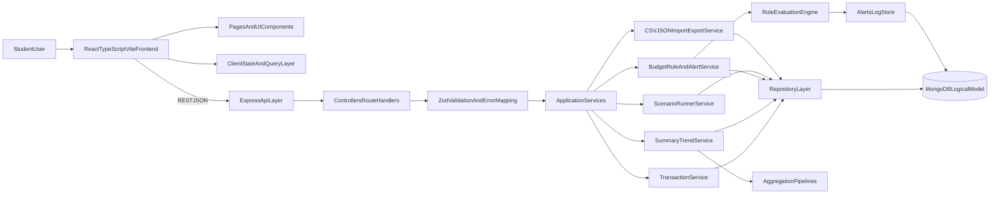

# Financial Assistant Architecture

## Module Boundaries
- `frontend`: React + Vite + Tailwind UI, route-level pages, forms, chart widgets, scenario runner.
- `backend`: Express API with layered boundaries: route controllers, validation, services, repository.
- `shared`: common JSON/TS schema contracts for transactions, rules, and summaries.
- `scenarios`: reproducible case-study inputs and expected outputs.
- `scripts`: seed and deterministic test-data generation utilities.

## Data Flow
1. UI submits transaction/rule forms to REST endpoints.
2. API validates input with Zod and maps errors into user-readable contracts.
3. Repository persists canonical store and returns normalized records.
4. Summary service computes totals, top categories, and trends.
5. Alert service evaluates active rules and emits explainable alert evidence.
6. UI renders dashboards/reports and scenario outputs.

## High-Level Diagram

## Technology Choices
- Frontend: React + TypeScript + Tailwind for velocity and maintainable visual consistency.
- Backend: TypeScript + Express to keep learning curve low while preserving strong layering.
- Data model: MongoDB-oriented document schema (`transactions`, `budgetRules`, `categories`, `alertsLog`) with index recommendations.
- Validation/testing: Zod + Vitest to keep behavior reproducible and easy to evaluate.
